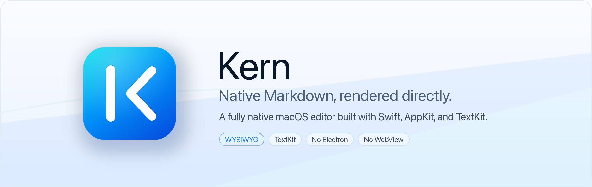
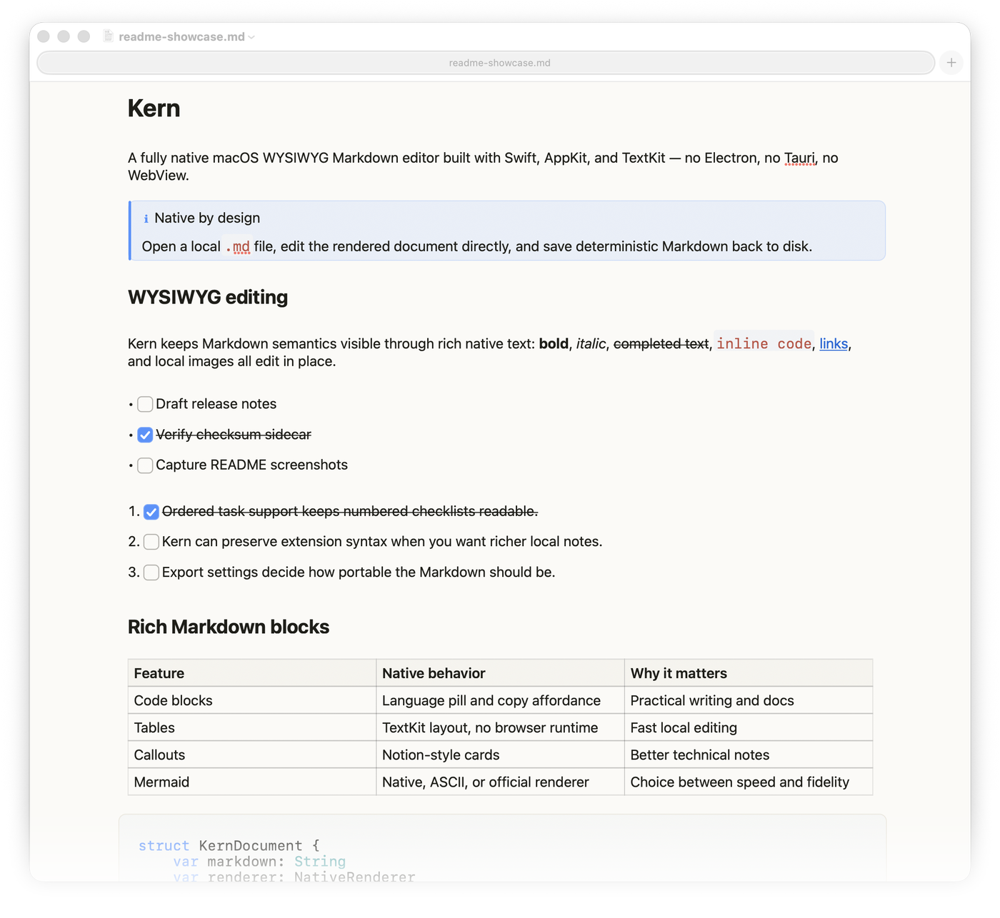
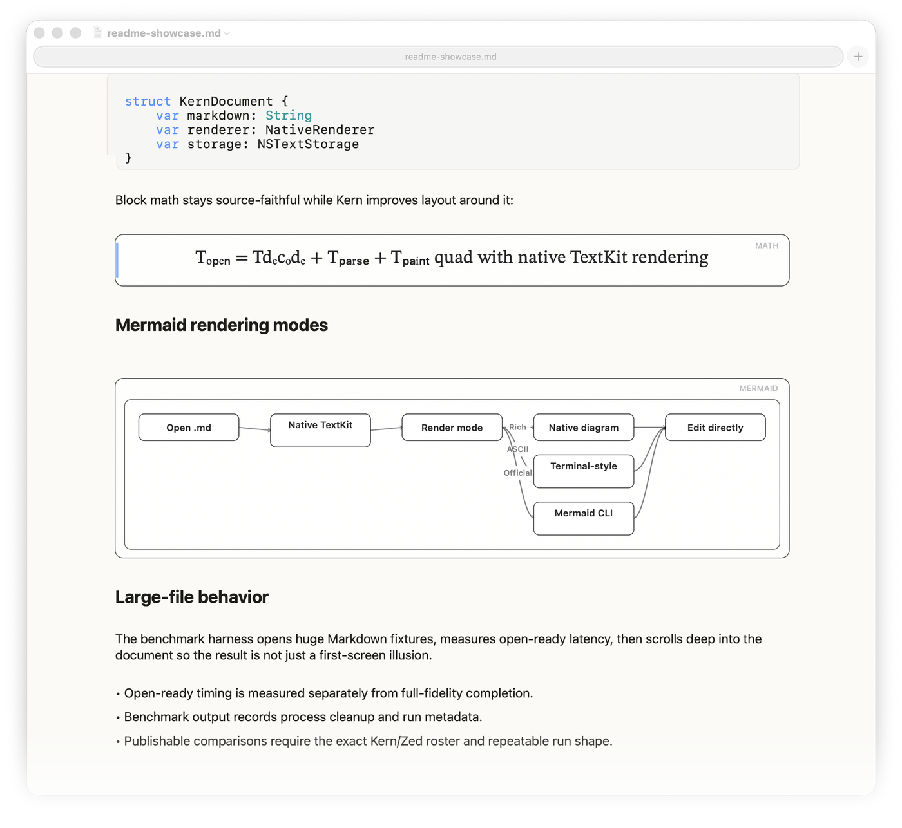
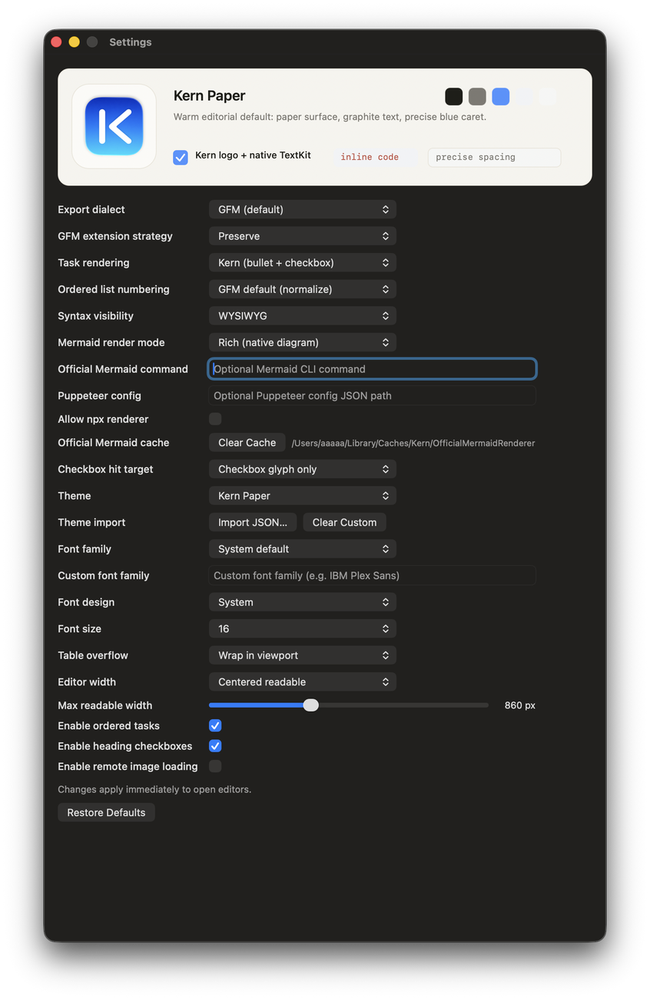
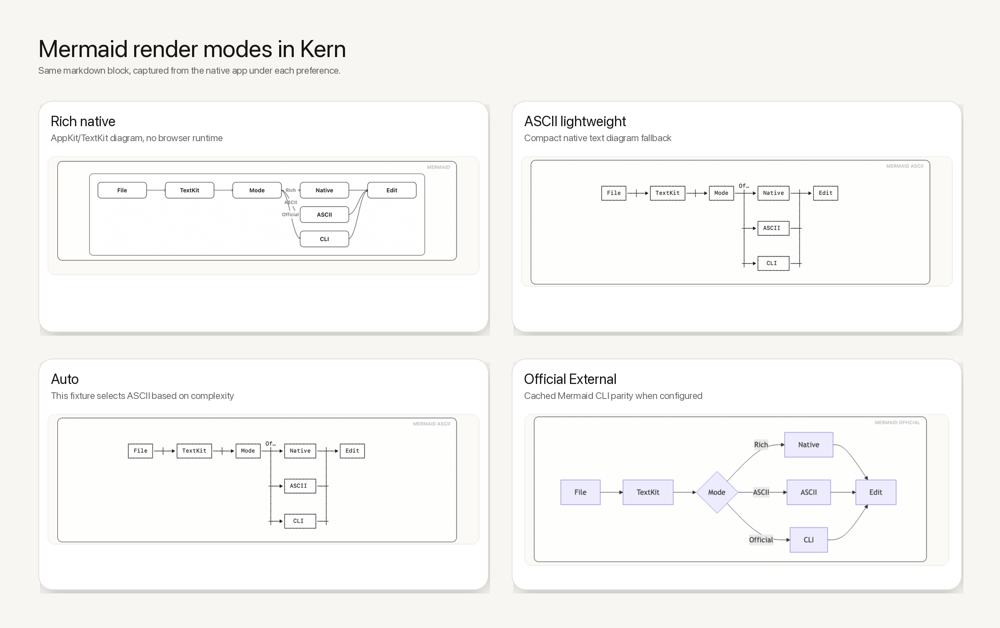

<p align="center">
  
</p>

# Kern

Kern is a fully native macOS WYSIWYG Markdown editor. You open a local `.md` file and edit rendered content directly, without living in raw markdown syntax.

This repository is the Kern codebase. The editor is built with Swift, AppKit, and TextKit. It does not use Electron, Tauri, or any WebView/browser runtime.

The product and app name are **Kern**.

## Why Kern Exists

Most local markdown workflows break down in one of these ways:

- You get a preview pane, but editing still happens in raw syntax.
- You get a rich editor, but it wants a project/workspace model instead of opening plain files.
- You get a web stack wrapped in desktop chrome, with bridge and runtime edge cases.

Kern is built for a simpler workflow: open any local markdown file, edit in true WYSIWYG, save back to deterministic markdown.

## Screenshots

These are real captures from the native app using `test-fixtures/readme-showcase.md` and `test-fixtures/readme-mermaid-modes.md`. They are intentionally captured from Kern itself rather than mocked in a design tool.

<p align="center">
  
</p>

<p align="center">
  
</p>

<p align="center">
  
</p>

## Mermaid Render Modes

Kern exposes Mermaid rendering as a preference instead of locking every user into one renderer:

<p align="center">
  
</p>

- **Rich (native diagram)** — the default bundled renderer. It draws supported diagrams with AppKit/TextKit and does not require a browser, Node, Electron, Tauri, or a WebView.
- **ASCII (lightweight)** — a native fallback for compact text-diagram rendering. It is useful as a readable fallback, but it is not official Mermaid parity and should not be marketed as the prettiest mode.
- **Auto** — chooses between native rich and ASCII based on diagram complexity. The screenshot above shows this fixture selecting ASCII.
- **Official External (cached)** — optional high-fidelity Mermaid CLI rendering when explicitly configured. It is disabled by default and falls back to native rendering when unavailable.

## What Kern Does Today

- True WYSIWYG as the default editing mode.
- Fully native macOS implementation, built on Swift + AppKit + TextKit.
- GFM-first markdown behavior, with optional Kern extensions.
- Deterministic import/export via native markdown codec.
- Checkboxes in multiple forms (standalone, bulleted tasks, ordered tasks, heading tasks).
- Native code block chrome (language pill + copy affordance).
- Native rendering paths for images, Mermaid, and math.
- Appearance preferences for themes, fonts, full-width editing, and centered readable columns.
- File watching, autosave, and standard macOS window/tab behavior.

## Quick Start (Open a Markdown File)

If you have built or installed the app bundle, open a markdown file with:

Open a markdown file in Kern:

```bash
open -a Kern /absolute/path/to/file.md
```

Optional shell helper:

```bash
kern() { open -a Kern "$@"; }
```

## Install From a GitHub Release

Latest release: [`v0.1.3`](https://github.com/gradigit/kern/releases/tag/v0.1.3).

When a tagged release includes binary assets, download:

- `Kern-macOS-Release.dmg`
- `Kern-macOS-Release.dmg.sha256`

Verify the download:

```bash
shasum -a 256 -c Kern-macOS-Release.dmg.sha256
```

Then:

1. open the DMG
2. drag `Kern.app` into `Applications`
3. launch `Kern.app` from `Applications`

Because the binary from this repository is currently unsigned and not notarized, macOS may block first launch. If that happens:

1. right-click `Kern.app` and choose `Open`
2. if needed, open **System Settings → Privacy & Security** and use **Open Anyway**

Detailed binary-install instructions live in [the GitHub release install guide](docs/release/installing-kern-from-github-release.md). The canonical public release gate lives in [Kern release validation gate](docs/release/release-validation-gate.md).

## Build And Run From Source

Requirements:

- macOS 14+
- Xcode 26.2+
- XcodeGen 2.45+ (`brew install xcodegen`)
- Python 3 with `venv`/`pip` for strict Markdown spec validation

CI is pinned to Xcode 26.x because the GitHub Actions default Xcode can lag behind the toolchain this repo currently requires.

Build:

```bash
xcodegen
xcodebuild -project KernTextKit.xcodeproj -scheme KernTextKit -configuration Debug -destination 'platform=macOS' build
```

Build + run with fixture:

```bash
./scripts/run-kern-native.sh test-fixtures/stress-test.md
```

Helpful local development modes:

```bash
./scripts/run-kern-native.sh --verify test-fixtures/stress-test.md
./scripts/run-kern-native.sh --logs test-fixtures/stress-test.md
```

Dedicated source-build instructions live in [the source-build guide](docs/release/building-kern-from-source.md).

## Test Commands

Fast non-snapshot unit lane:

```bash
./scripts/test-native-editor.sh --no-snapshots
```

Default unit + snapshot suite:

```bash
./scripts/test-native-editor.sh
```

`--unit-only` is kept only for backward compatibility; unit tests are the only native test mode now.

Exhaustive lanes:

```bash
./scripts/test-native-editor.sh --exhaustive
./scripts/test-native-editor.sh --snapshots --exhaustive
```

Strict markdown spec conformance (CommonMark/GFM lane):

```bash
./scripts/test-markdown-spec-conformance.sh
```

Orchestrated exhaustive gate:

```bash
./scripts/run-exhaustive-native-suite.sh
```

Notes:

- Exhaustive lanes are intentionally strict and slower.

## Packaging From Source

Build the local development artifacts:

```bash
./scripts/package-kern-app.sh
```

This currently produces an unsigned app bundle and DMG for local development and evaluation.

It also writes the matching SHA-256 sidecar for the DMG.

Maintainer-facing release publication steps live in [the GitHub release checklist](docs/release/github-release-checklist.md). The canonical release gate is defined in [Kern release validation gate](docs/release/release-validation-gate.md).

Signed/notarized macOS distribution is not published from this repository.

## Benchmark and Evaluation Packets

For benchmark-harness changes, use the packet mode so the run keeps the raw log,
command, preflight metadata, process snapshots, summary JSON, markdown summary,
and readiness-capture directory together unless screen capture is disabled:

```bash
./scripts/cross-editor-benchmark.sh \
  --suite benchmark_open_ready \
  --editors "TextKit Baseline" \
  --artifact-dir benchmark-archive/cross-editor-preflight/local-preflight \
  --preflight-only
```

For real cross-editor runs, use `--artifact-dir` with the normal editor roster.
Artifact mode validates the emitted JSON by default and fails if the run is
partial, missing required metrics, malformed, or missing fixture identity data.
Use `--allow-partial-artifacts` only for diagnostic packets that should not be
used for README, release, or social-performance claims.

Compare baseline and candidate packets with:

```bash
python3 scripts/bench-regression-check.py \
  --baseline benchmark-archive/baseline/metrics-summary.json \
  --latest benchmark-archive/candidate/metrics-summary.json
```

## Useful Docs

- [Kern Markdown dialect](KERN-MARKDOWN.md)
- [Contributor guide](CONTRIBUTING.md)
- [Native editor test suite](docs/plans/native-editor-test-suite.md)
- [Markdown spec tracker](docs/plans/markdown-spec-failure-tracker.md)
- [Missing native-editor feature plan](docs/plans/native-editor-missing-features-implementation-plan.md)
- [Dependency policy](docs/dependencies.md)
- [Release validation gate](docs/release/release-validation-gate.md)

## Current Focus Areas

- Task permutation and GFM/Kern profile behavior
- Ordered task numbering semantics
- Heading checkbox behavior
- Code block chrome interactions
- Image attachment edge cases
- Mermaid and math layout quality
- Anchor navigation behavior
- Find/replace overlay non-obstruction
- Exhaustive real-typing behavior

## Contributing

See:

- [CONTRIBUTING.md](CONTRIBUTING.md)
- [SECURITY.md](SECURITY.md)
- [SUPPORT.md](SUPPORT.md)
- [CODE_OF_CONDUCT.md](CODE_OF_CONDUCT.md)

If you want to contribute:

1. Open an issue first for larger behavior or architecture changes.
2. Keep changes aligned with the native test-suite plan documents.
3. Run at least `./scripts/test-native-editor.sh --no-snapshots` before opening a PR. Run the default `./scripts/test-native-editor.sh` locally when rendering or snapshots may be affected; CI keeps snapshots out of the baseline because runner rendering can drift.

For review requests, include failing/passing test evidence and any snapshot or UI artifacts that explain behavior changes.

## Status

- Kern is the current native macOS app codebase.
- This repository is a public source project.
- Tagged releases may include an unsigned DMG plus checksum; signed/notarized macOS distribution is not published from this repository.
- This repository is licensed under **Apache-2.0**.
- Latest public release: `v0.1.3`.
- Full-fidelity benchmark work remains deferred.
