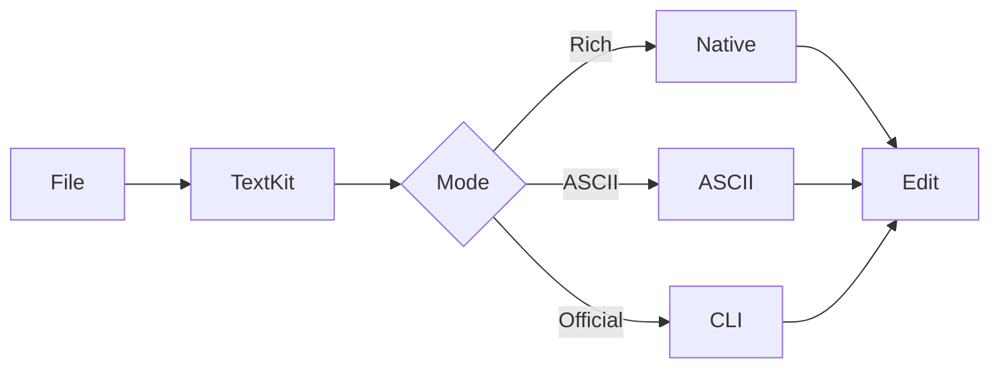

# Mermaid render modes

Kern lets the same Mermaid block render through native rich, lightweight ASCII, automatic selection, or the optional official Mermaid CLI cache.

The default path stays native and fast. Official Mermaid rendering is opt-in for users who want CLI parity and are comfortable configuring the external renderer.
