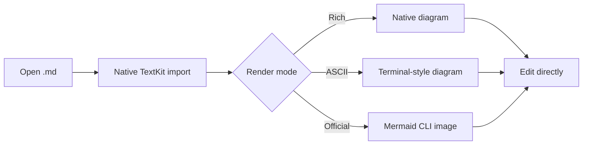

# Kern

A fully native macOS WYSIWYG Markdown editor built with Swift, AppKit, and TextKit — no Electron, no Tauri, no WebView.

> [!NOTE] Native by design
> Open a local `.md` file, edit the rendered document directly, and save deterministic Markdown back to disk.

## WYSIWYG editing

Kern keeps Markdown semantics visible through rich native text: **bold**, *italic*, ~~completed text~~, `inline code`, [links](https://github.com/gradigit/kern), and local images all edit in place.

- [ ] Draft release notes
- [x] Verify checksum sidecar
- [ ] Capture README screenshots

1. [x] Ordered task support keeps numbered checklists readable.
2. [ ] Kern can preserve extension syntax when you want richer local notes.
3. [ ] Export settings decide how portable the Markdown should be.

## Rich Markdown blocks

| Feature | Native behavior | Why it matters |
| --- | --- | --- |
| Code blocks | Language pill and copy affordance | Practical writing and docs |
| Tables | TextKit layout, no browser runtime | Fast local editing |
| Callouts | Notion-style cards | Better technical notes |
| Mermaid | Native, ASCII, or official renderer | Choice between speed and fidelity |

```swift
struct KernDocument {
    var markdown: String
    var renderer: NativeRenderer
    var storage: NSTextStorage
}
```

Block math stays source-faithful while Kern improves layout around it:

$$
T_{open} = T_{decode} + T_{parse} + T_{paint} \quad \text{with native TextKit rendering}
$$

## Mermaid rendering modes



## Large-file behavior

The benchmark harness opens huge Markdown fixtures, measures open-ready latency, then scrolls deep into the document so the result is not just a first-screen illusion.

- Open-ready timing is measured separately from full-fidelity completion.
- Benchmark output records process cleanup and run metadata.
- Publishable comparisons require the exact Kern/Zed roster and repeatable run shape.
